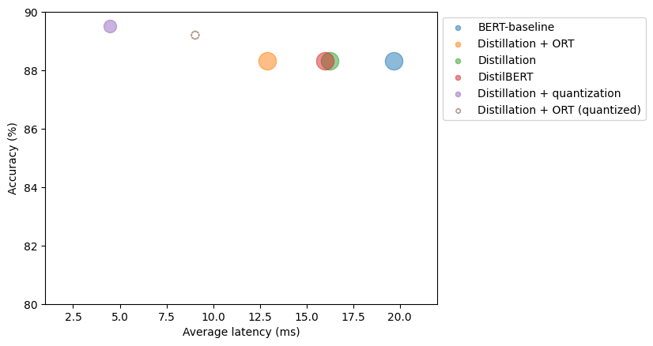
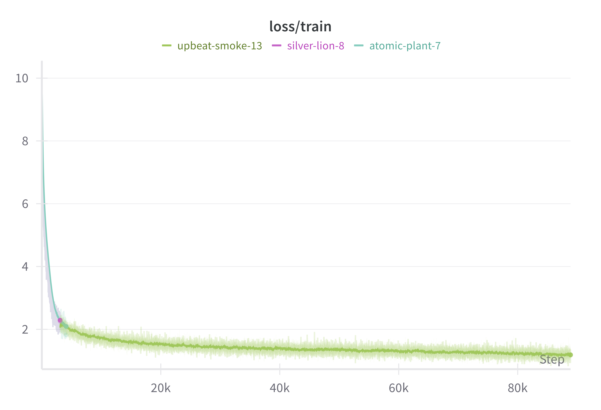

# 🤖 Natural Language Processing with Transformers – Personal Project

---

## 📘 Book Overview

 This project is based on hands-on implementations inspired by the book **“Natural Language Processing with Transformers”** by [Tunstall, von Werra & Wolf](https://transformersbook.com/). Over several weeks, I studied, coded, and implemented advanced NLP techniques using Hugging Face's cutting-edge tools.


**Topics Covered:**

### 🌟 Foundations of Transformers
- **Hello Transformers**: Introduction to Transformer models and the Hugging Face ecosystem  
- **Text Classification**: Fine-tuning BERT for sentiment analysis and NER
    
- **Transformer Anatomy**: Deep dive into self-attention and encoder-decoder architectures

---

### 🌍 Multilingual & Cross-lingual NLP
- **Multilingual NER**: Using XLM-R for Named Entity Recognition across languages  
- **Cross-lingual Transfer**: Evaluating models in zero-shot settings
    

---

### ✍️ Generation, Summarization, and QA
- **Text Generation**: Exploring decoding techniques — sampling, top-k, top-p
- **Summarization**: Training models and evaluating with BLEU and ROUGE
    > Comparing models' summaries:
    >   GROUND TRUTH
    >   Mentally ill inmates in Miami are housed on the "forgotten floor"
    >   Judge Steven Leifman says most are there as a result of "avoidable felonies"
    >   While CNN tours facility, patient shouts: "I am the son of the president"
    >   Leifman says the system is unjust and he's fighting for change .
    >
    >    BASELINE
    >    Editor's note: In our Behind the Scenes series, CNN correspondents share their experiences in covering news and analyze the stories behind the events.
    >    Here, Soledad O'Brien takes users inside a jail where many of the inmates are mentally ill. An inmate housed on the "forgotten floor," where many mentally ill inmates are housed in Miami before trial.
    >    MIAMI, Florida (CNN) -- The ninth floor of the Miami-Dade pretrial detention facility is dubbed the "forgotten floor."
    >
    >   GPT2
    >   - The mentally ill incarcerated in Miami-Dade have no rights, except to be safe and locked in their cells until the court date arrives.
    >   - As you'd expect, mental illness plays a major part in their arrests.
    >   - The mentally ill inmates get no help from the jail staff.
    >   - They are put in jail on the "forgotten floor," where they're treated
    >
    >  T5
    >   mentally ill inmates are housed on the ninth floor of a florida jail .
    >   most face drug charges or charges of assaulting an officer .
    >   judge says arrests often result from confrontations with police .
    >   one-third of all people in Miami-dade county jails are mental ill .
    >
    >   BART
    >   Mentally ill inmates are housed on the "forgotten floor" of Miami-Dade jail.
    >   Most often, they face drug charges or charges of assaulting an officer.
    >   Judge Steven Leifman says the arrests often result from confrontations with police.
    >   He says about one-third of all people in the county jails are mentally ill.
    >
    >   PEGASUS
    >   Mentally ill inmates in Miami are housed on the "forgotten floor"<n>The ninth floor is where they're held until they're ready to appear in court.
    >   Most often, they face drug charges or charges of assaulting an officer.
    >   They end up on the ninth floor severely mentally disturbed .

    


- **Question Answering**:  
  - **Extractive** and **Generative** QA approaches  
  - Dense Passage Retrieval (**DPR**) with **FAISS** indexing  
  - Retrieval-Augmented Generation (RAG)

---

### ⚙️ Scaling & Deployment
- **Efficient Transformers**:  
  - Optimization methods: Quantization, Pruning, Distillation
    
  - Graph optimization with **ONNX** and **ONNX Runtime (ORT)**
- **Few-Shot & Zero-Shot Learning**:  
  - Using pre-trained BERT and GPT-2  
  - Techniques like **Zero-shot classification**, **UDA**, and **UST**  
  - Data augmentation, embeddings, and domain adaptation
    

---

### 🧠 Pretraining from Scratch
- **Code Autocompletion LLM**:  
  - Created a large-scale custom dataset  
  - Built a domain-specific tokenizer (Python code)  
  - Trained a small GPT-2 model from scratch using 🤗 Accelerate on multi-GPU setup


---

### 🔮 Future Directions in Transformers
- **Scaling Laws & Bottlenecks**:  
  - Understanding model scaling  
  - Efficiency breakthroughs: **Sparse Attention**, **Linearized Attention**
- **Beyond Text**:  
  - Introduction to **Vision Transformers (ViT)**  
  - Exploring multimodal models like **CLIP** and **DALL·E**

---

## 📂 Project Structure

```bash
📦NLPTransformers
    ┣ 📁notebooks/
    ┣ 📁codeparrot/scripts/
        ┣ arguments.py
        ┣ codeparrot_train.py
    ┣ img/              
    ┗ 📄README.md