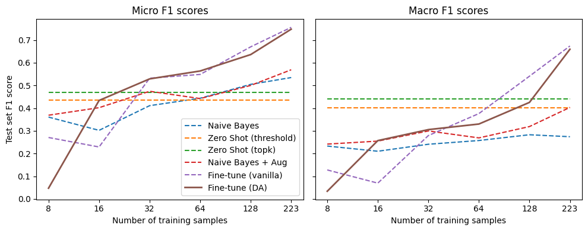
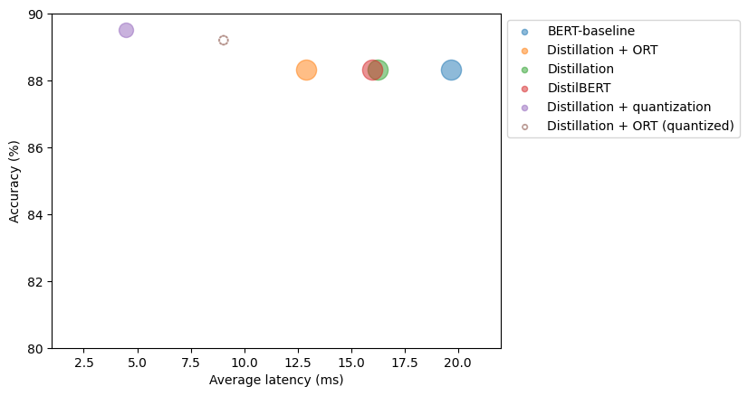
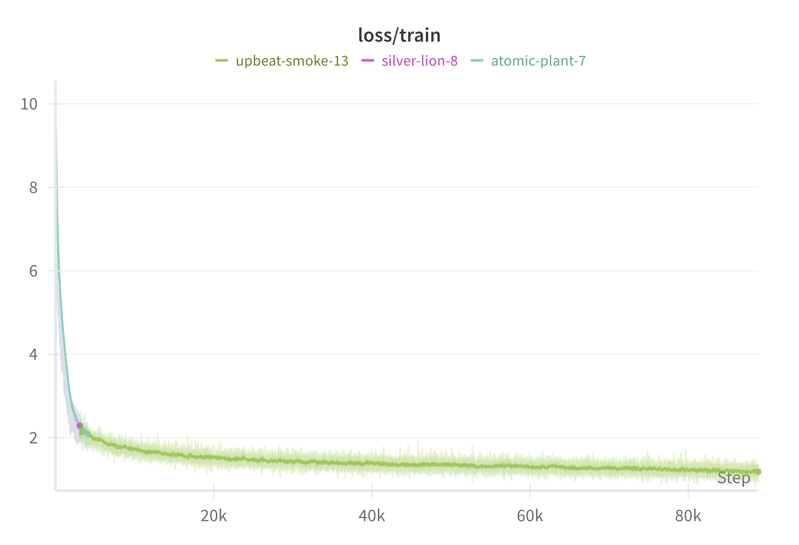

# Learning [Deep Learning]
Welcome! 
This repository documents my complete [deep] learning journey.

---

## 🚀 My Goals & Motivation

✅ Build real-world skills with state-of-the-art NLP  
✅ Understand transformer architectures beyond black-box usage  
✅ Learn practical workflows with 🤗 Transformers and Datasets  
✅ Develop a project portfolio to demonstrate deep learning capabilities

---

# 🛠️ Projects

## 🤖 Natural Language Processing with Transformers

> 📘 A hands-on implementation of state-of-the-art NLP using **Transformers**, based on the book by Tunstall, von Werra & Wolf.  
> 🛠 Built with 🤗 Transformers, PyTorch, ONNX Runtime, and more.

---

### 📌 Overview

Over several weeks, I explored modern NLP through full-stack implementations — from fine-tuning BERT to training a GPT-style model from scratch — applying lessons to real-world tasks such as:

- 🌟 **Text Classification** (Sentiment, NER)
- 🌍 **Multilingual Transfer Learning** (XLM-R, zero-shot NER)
- ✍️ **Text Generation & Summarization** (T5, BART, PEGASUS)
- ❓ **Question Answering Systems** (DPR + FAISS + RAG)
- ⚡ **Transformer Optimization** (Quantization, Distillation, ONNX)
- 🧠 **Training from Scratch** (Custom GPT-2 for code autocompletion)
- 🔮 **Emerging Architectures** (Sparse Attention, ViT, CLIP, DALL·E)

---

### 📊 Sample Outputs

> 🧾 **Zero-Shot & Few-Shot Learning Comparison** (Pre-trained vs Data Augmentation vs Fine-tuning)
>
> 

> 📈 **Model Efficiency Optimization**
>
> 

> 🔁 **117M parameter GPT-2 Python Code Autocompletion Model Training**
>
> 

---

### 🧠 Key Results & Learnings

- ✅ Fine-tuned multiple models for classification, generation, and QA
- 🧩 Used FAISS & DPR for scalable document retrieval
- ⚙️ Built an efficient multi-GPU pipeline with `🤗 Accelerate`
- 🧪 Compared summarization quality using BLEU, ROUGE, and ground-truth
- 🔧 Applied optimization techniques to reduce latency in production

---

### 🔗 Tools & Libraries Used

- [🤗 Transformers](https://github.com/huggingface/transformers)
- [🤗 Datasets](https://github.com/huggingface/datasets)
- [🤗 Accelerate](https://github.com/huggingface/accelerate)
- [PyTorch](https://pytorch.org/)
- [scikit-learn](https://scikit-learn.org/)
- [FAISS](https://github.com/facebookresearch/faiss)
- [ONNX](https://onnx.ai/)
- [ONNX Runtime](https://onnxruntime.ai/)
- [Weights & Biases](https://wandb.ai/) *(optional for experiment tracking)*

---

## 🐍 Python Course

## 🐳 [Andrew Karpathy](https://karpathy.ai/)'s NN Zero-to-Hero

---

# 🧑‍💻 About Me

**Sergi Sánchez Bonilla**  
Machine Learning Practitioner | NLP Explorer | Lifelong Learner

📫 [LinkedIn](https://www.linkedin.com/in/sergi-sanchez-bonilla)  
